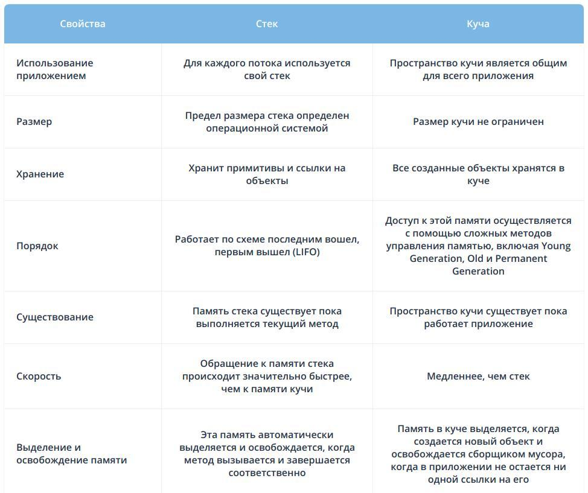

- Heap (куча) используется Java Runtime для выделения памяти под объекты и классы. Создание нового объекта также происходит в куче. Это же является областью работы сборщика мусора. Любой объект, созданный в куче, имеет глобальный доступ и на него могут ссылаться из любой части приложения.

- Stack (стек) это область хранения данных также находящееся в общей оперативной памяти (RAM). Всякий раз, когда вызывается метод, в памяти стека создается новый блок, который содержит примитивы и ссылки на другие объекты в методе. Как только метод заканчивает работу, блок также перестает использоваться, тем самым предоставляя доступ для следующего метода. Размер стековой памяти намного меньше объема памяти в куче. Стек в Java работает по схеме LIFO (Последний-зашел-Первый-вышел)

